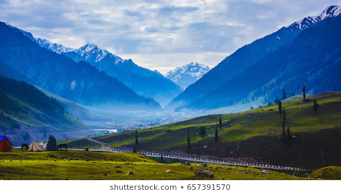
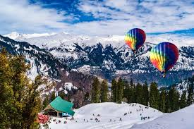

# assignment2-arla
# PRASANNA ARLA
###### NOODLES
> Noodles are  **staple food** in many cultures made from unleavened dough. I like to have the because they are **slippery** and tastes very spicy and i love to have them.


---

# sun rises in the east and sets in the west
1. boil some amount of water
2. then add few pinches of coffe powder
3. after three to four minutes add milk to it
4. stir
    1. ocassionally and boil for two minutes
5. remove from heat and let it sit down for four minutes
6. then use a laddle scoop the finished coffe into the mug
- coffee powder
- sugar
- milk

**[prasanna arla](AboutMe.md)**
---
# places to visit
 In this paragraph I am going to list the places to visit in the table.
 |location | number of hours | amount of money |
 | :---: |:---: | :---: |
 |kashmir | 8 | 200$ |
 |manali | 9 | 300$ |
 |meghalaya | 3 | 150$ |
 |himalayas | 4 | 250$ |
 
 
 
 
 
  ---
 # Pithy Quotes
 > “ The purpose of our lives is to be happy.” — **Dalai Lama*.

 > “ Get busy living or get busy dying.” — *Stephen King*.
---
# code fencing
> LiveScript is a functional programming language that compiles to JavaScript. It was created by Jeremy Ashkenas—the creator of CoffeeScript—along with Satoshi Muramaki, George Zahariev, and many others.
Source Link <https://en.wikipedia.org/wiki/LiveScript>
```
# Easy listing of implicit objects
table1 =
  * id: 1
    name: 'george'
  * id: 2
    name: 'mike'
  * id: 3
    name: 'donald'
```
Source Link <https://livescript.net/>


